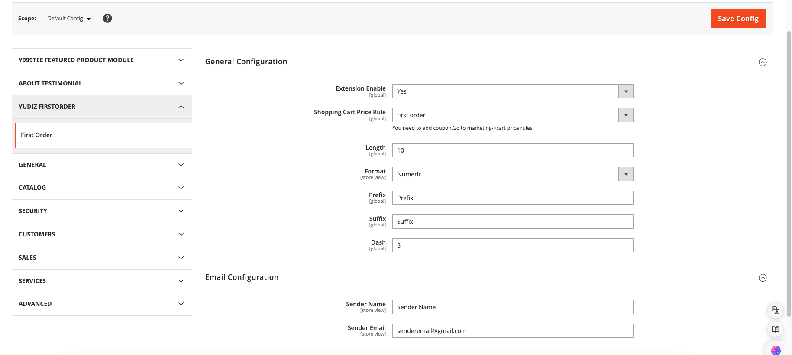
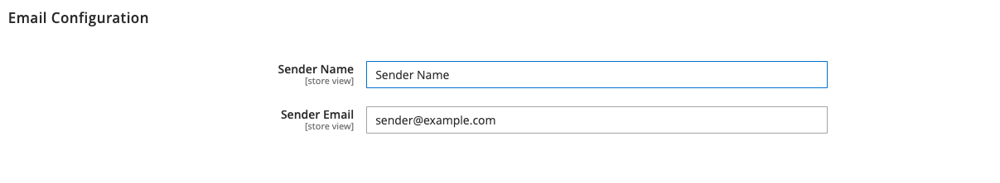
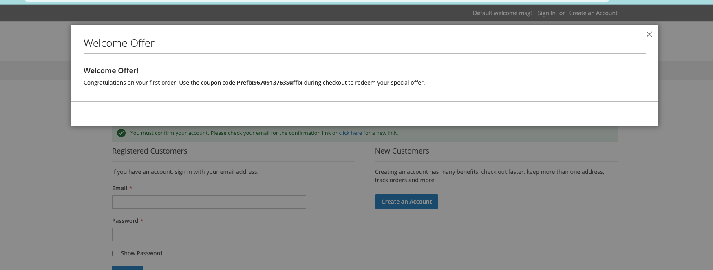
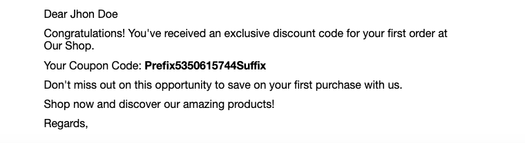

# First Order Discount for Magento 2

The First Order Discount Magento 2 extension is like a helpful assistant for your online store. It gives new customers a special discount when they make their first purchase. This makes it more likely for people visiting your store to become paying customers. The extension creates unique discount codes for each new customer, which are automatically applied when they checkout. This makes shopping easier for them and increases the chances of them completing their purchase.


For the store owner, the extension is easy to use. You can adjust the discount settings as per your needs. The extension sends the discount codes to the customers when they register and also via email. With this extension, you can attract more customers and keep them coming back for more.

## Features

- Easy to use
- User-friendly interface
- Users can easily obtain a coupon code for their first order discount
- And receive an email with the same coupon code.
- Admins can easily configure the module

## Installation

You can install the Yudiz First Order Extension using one of two methods:
 1. Via Composer 
 2. By downloading it directly from the available source.

### 1. Install via composer

Before installing the Yudiz First Order Extension, it is necessary to install the Yudiz Core module. You can obtain the Yudiz Core module by using the following code.

Run the following command:
```shell
composer require yudiz/module-core
```
Now, To install the Yudiz First Order Extension via Composer, follow these steps in   your Magento 2 root folder:

Run the following command:
```shell
composer require yudiz/firstorder
```
After a successful installation, execute the following commands:

```shell
php bin/magento setup:upgrade
php bin/magento setup:static-content:deploy -f
php bin/magento c:c
```

With these steps completed, you'll be ready to utilize the Yudiz First Order Extension.

### 2. Download Directly

Before Downloading the Yudiz First Order Extension, it is necessary to have the Yudiz Core module. You can download the module directly from below link:

https://github.com/yudiz-solutions/yudiz-core

Once the zip file is downloaded, extract its contents within the 'app/code/Yudiz/Core' directory.

Now, To install the Yudiz First Order Extension you can download the Extension from below link:

https://github.com/yudiz-solutions/magento-firstorder-discount

After successfully downloading the module, follow these steps to install it:

1.Unzip the downloaded folder.

2.Place the unzipped extension folder into the following path:

```shell
project-root-directory/app/code/Yudiz/FirstOrder
```

Indeed, after placing the extension folder in the specified directory, follow these Magento commands to complete the installation:
```shell
php bin/magento setup:upgrade
php bin/magento setup:static-content:deploy -f
php bin/magento c:c
```

By following these 2 Ways you can easily obtain and install the module.  For detailed instructions on its usage, refer to the user guide within this document.


## Features 
- Customers can receive dynamic coupon codes for their first order
- Admins can easily configure the settings for the dynamic coupon codes

## Magento 2 First Order User Guide

Login to the **Magento Admin**, navigate to `Yudiz -> First Order Configuration `.

<div>
    
</div><br/>

#### General Configuration 

- Extension enable : Select Yes/No to enable or disable the module
- Shopping Cart price Rule : Choose the shopping Cart price Rule.
Create cart price rule from Marketing -> Promotions -> Cart Price Rules

<div>
    
</div><br/>

- Inside Cart Price Rule:

   - Coupon :  choose ‘Specific Coupon' for the coupon option
   - Use Auto Generation : Check Use Auto Generation


- Length : Specify the length of the generated coupon code. It determines how many characters the coupon code will have.
  Example : "Length: Enter the desired length for the coupon code (e.g., 10)"
- Format: Choose the format of the coupon code, whether it's alphanumeric, alphabetical, or numeric.
  Exampl e: "Format: Select the format for the coupon code (e.g., Alphanumeric, Alphabetical, Numeric)"
- Prefix : Define a prefix to be included at the beginning of each generated coupon code.
  Example : "Prefix: Enter the prefix to be added before the coupon code (e.g., FIRSTORDER)"
- Suffix : Define a suffix to be included at the end of each generated coupon code.
  Example : "Suffix: Enter the suffix to be added after the coupon code (e.g., OFF)"

#### Email Configuration 

<div>
    
</div><br/>

- Sender Name : Set the sender's name
- Sender Email : Set Sender’s email address  for Send Email


After completing these steps, click on "Save," which will save the configuration.

## Frontend 

After a customer registers, a pop-up will appear, presenting them with their first order discount coupon code. Additionally, the customer will receive an email notification detailing the discount available on their first order.

<div>
    
</div><br/>

<div>
    
</div><br/>


As you can see in the screenshot above, customers will receive the coupon codes after successful registration. Also, they will receive an email containing the discount code for their first order.


